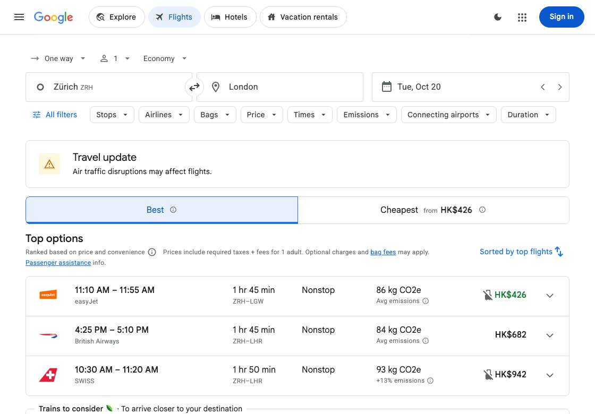

# 实际 API 规划与 Laya 执行 · 2026-09-26

## 结果

本次由本机 OpenAI-compatible API 实时生成计划，再由 Laya 操作 Google Flights，成功查询 2026-10-20 苏黎世到伦敦、单程、1 位成人、经济舱。不是预写计划回放，也没有请求 Qwen。

| 项目 | 修复后实测 |
| --- | --- |
| 请求模型 / 服务返回模型 | cx/gpt-6-luna / gpt-6-luna |
| 规划调用 | 1 次 |
| 规划耗时 | 4.705 秒 |
| 接口报告 token | 输入 1039、输出 144、总计 1183 |
| 本地 Laya 调用 | 14 次 |
| 浏览器操作 | 14 步，含等待 |
| 总循环耗时 | 8.461 秒，包含规划 |
| 独立结果检查 | 9 项全部通过 |

耗时排除模型加载和首次导航。服务返回的模型身份和 token 用量为接口声明，未核验代理的上游部署或费用。截图价格是当时的历史观察。没有选择或预订航班。

## 修复了什么

失败运行中，GPT 计划已经正确要求 `one-way`，但 Laya 把 `Round trip` 判为已满足，概率达 0.9436。随后日历中的日期文字又触发了过宽的完成规则，导致 Agent 输出 done 而独立检查失败。

- 单程、往返、多程这些已知互斥值采用确定性比较，兼容英文空格/连字符和中文；未知值保留原语义判断，不把所有不同字符串一律当成冲突。
- 结果证据按不同要求的值计数。同一个日期的月、日、年只能算一组，不能充当三份独立结果证据。
- 已观察到弹窗内控件时不报告搜索完成；完成仍需新出现的多条结果证据，而不是模型的单个判断。

新增回归测试先在旧代码上复现错误，再验证修复。修复前后 API 生成的计划完全相同，因此这次成功不是靠换一份更容易执行的计划。策略未加入站点专用选择器、固定航线或预设点击序列。结果识别仍是启发式，独立检查不能移除。

## 回归与边界

114 项离线测试通过；Ruff、两份 JavaScript 语法检查、源码包与 wheel 构建通过。另用保存计划测量三个本地场景：酒店、研究文章、中文车票均通过；Wikipedia 仍未通过。这四项回归没有额外请求用户的 API，不应称为该 API 的四项端到端成绩。

本次是真实 API 下的一次成功复测，不是通用可靠性评估，也不能与排除规划时间的旧示例直接比较速度。

## 证据

- [模型用量、完整计划、九项检查和回归汇总](api-planner-measurement-20260926.json)
- 原始本机记录：`artifacts/local-api-fix-20260926/`
- 修复前失败记录：`artifacts/local-api-flights-20260926/`

密钥仅经隐藏输入进入测试进程，没有存入代码、配置、报告或仓库。现有演示启动器仍使用原有配置，本次未永久修改它的规划器。复用任意兼容 API 时，在调用标准评估入口前设置 `TEXT_MODEL_BASE_URL`、`TEXT_MODEL` 和进程内的 `TEXT_MODEL_API_KEY`；不要使用替代规划器的 `evaluate_supplied` 入口来声称实时 API 测试。
