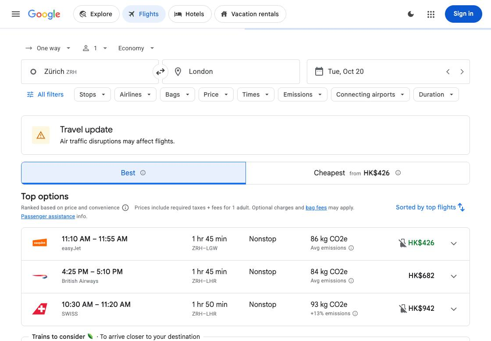

# 实例：让本地 Laya 查询 Google Flights

**任务：**查询 2026 年 10 月 20 日苏黎世到伦敦、单程、1 位成人、经济舱，停在航班结果页。

2026-09-26 的实际运行完成了任务：**6.631 秒、11 次本地 Laya 调用、9 项独立检查通过**。运行使用 Codex 对话中预先提供的 GPT 计划，没有调用 Qwen 或 GPT API；执行耗时排除计划生成、模型加载和首次导航。这是本项目的实测，不是官方 Jev 模型的复测或通用成功率。

## 实际截图



截图是当次运行的原始最终画面，价格为历史页面显示，不代表当前报价。没有选择或预订航班。

## 运行方式

需要 Apple Silicon Mac、Chrome、Python 3.12+ 和 uv。在仓库根目录打开两个终端。

**终端一：准备模型并启动隔离浏览器和本地服务。** 已安装并缓存模型时可以直接执行最后一行。

```bash
uv sync --extra local
uv run --extra local hf download aac6fef/laya-multilingual-mlx
uv run --extra local hf download mlx-community/Qwen3-1.7B-4bit
uv run --extra local --offline python examples/local_demo.py
```

**终端二：仅运行这一个查票任务。**

```bash
uv run --extra local --offline python -m examples.evaluate_supplied \
  --plans docs/supplied-plans-20260926.json \
  --scenarios flights --max-steps 50 \
  --output artifacts/verification/flights-example
```

启动器会加载本地 Qwen 服务，但这个保存计划的评估入口不会请求它，并明确禁止文本模型 API 调用。公共网站仍需要联网。此次入口直接操作隔离浏览器并输出验证记录；8770 检查器的 Start demo 是另一条演示流程，不会自动显示这次评估的实时状态。

结果写入 `artifacts/verification/flights-example/flights.json` 和 `summary.json`。检查 `verified` 和 `verification.checks`，不能只看 `status: done`。未通过时程序返回非零退出码。终端一按 Ctrl+C 停止服务。

本例日期固定为 **2026-10-20**。过期后重测需同时更新 `examples/evaluate_local.py` 的 `DAY`，以及计划文件中 flights 的 Departure 和 finish 日期；新运行不属于本页记录的那次测量。

## 本次执行的 11 步

1. 打开票型菜单。
2. 选择单程。
3. 输入 Zurich。
4. 选择 Zurich Airport (ZRH)。
5. 输入 London。
6. 选择 London, United Kingdom。
7. 输入出发日期。
8. 选择日历中的 2026 年 10 月 20 日。
9. 确认日期，关闭日历弹窗。
10. 点击主表单的 Search。
11. 等待航班结果，随后独立检查。

这是实际动作记录的说明，生产策略并未硬编码这套操作序列。

## 可核对的证据

- [计划、逐步动作、时间和九项检查](flights-example-evidence.json)
- [完整修复说明与其他场景的成功/失败](flight-dialog-fix-20260926.md)
- [保存计划的执行入口](../examples/evaluate_supplied.py)
- [航班结果独立检查](../examples/flights.py)

原始完整轨迹和中间失败记录仍保留在开发机的 `artifacts/flight-dialog-fix-20260926/`；仓库内 JSON 是注明字段范围的摘录，截图未改绘。
