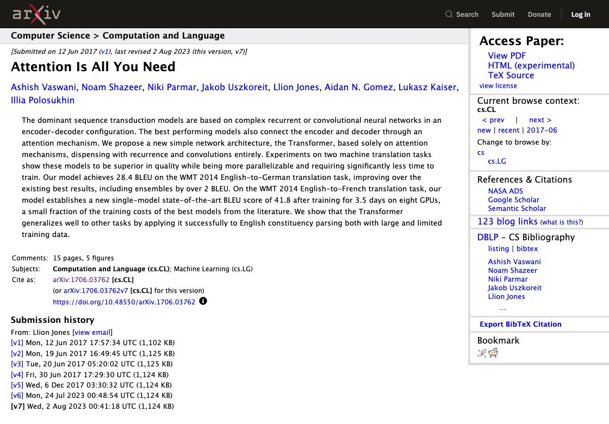

# 搜索结果关联与返回纠错（2026-09-26）

## 本轮修改

- 将可见链接与最近的语义结果卡片（article、li、row 等）关联，提取标题和附近作者文字，不拼接网站专用链接或选择器。
- 优先完整标题匹配；限定名如 org/project 同时核对已观察到的路径。优先卡片主链接，减少误点作者、PDF 和下载入口。
- 有结构化结果但没有匹配项时，交由有限纠错，不把隐私政策等无关导航当作论文候选。
- 支持页面提供的相关性排序，并提交排序表单；查询参数变化也能确认提交已经生效。
- 在明确提供标题搜索的表单中，允许一次带引号的标题短语检索。它是有条件的尝试，不假定所有网站都支持同一种查询语法。
- 结果已经出现时继续扫描，不固定空等；最多扫描 24 个滚动位置，总动作预算仍为 60，验收脚本为 40 次 tick。
- 详情标题不符时最多返回两次，记住排除链接；返回后先等待导航，浏览器操作失败不自动重放。

## 本轮最终真实 API 验收

规划入口为用户提供的本地兼容 API，请求 cx/gpt-6-luna，响应 gpt-6-luna；候选决策使用本机 Laya。以下来自同一轮运行，均同时要求 DONE 与独立页面核验通过。

| 场景 | 独立核验 | 秒 | 浏览器动作（含等待和滚动） | 规划 API 调用 | Laya 调用 |
|---|---|---:|---:|---:|---:|
| wikipedia | 通过 | 5.905 | 3 | 1 | 2 |
| github | 通过 | 14.565 | 7 | 2 | 2 |
| gutenberg | 通过 | 4.990 | 4 | 1 | 2 |
| arxiv | 通过 | 18.797 | 29 | 2 | 2 |
| flights | 通过 | 15.070 | 14 | 1 | 14 |

arXiv 原论文在当次短语查询中列于第 47 条、约 11,463 像素处。原来的 8 次滚动预算只能查看到约 4,480 像素，过早放弃；最终过程扫描 20 次后打开 /abs/1706.03762。链接关联与更合理的扫描预算共同促成这次成功。

## 核验修正与失败记录

旧 arXiv 核验硬性要求界面含 `Abstract:`，但原论文当前页面直接展示摘要内容，没有这个标签。新版独立核验保留精确论文编号、完整标题、作者，并验证摘要开头、Transformer 描述和末尾主题。没有仅凭 DONE 改成通过；对应 screenshot 和原始正文已经核对。

开发过程中保留了 BLOCKED、浏览器 Runtime.evaluate 超时、排序未提交、查询参数变化未被识别等失败记录。中间一次先进入作者页，返回后成功打开原论文；最终轮次直接打开论文，没有误点作者。

这些是指定任务的单次验收，不能推导通用成功率或稳定耗时。卡片识别依赖 DOM 结构；卡片首链接也不保证永远是详情入口；跨页结果超过预算仍可能失败。

本轮所有开发与验收迭代合计 30 次 API 请求，响应报告共 74,394 tokens；这不是最终一次运行的用量。未换算费用。

[机器可读记录（包含失败迭代）](result-cards-20260926-measurement.json)。完整原始轨迹在本地 artifacts/result-cards-*。

## 回归与静态检查

固定计划、真实本地 Laya 的 travel、research、zh 三个本地示例均通过独立核验，未调用规划 API。离线测试 145 项通过，Ruff、snapshot.js 与 app.js 语法检查、uv build 和 git diff --check 通过。
